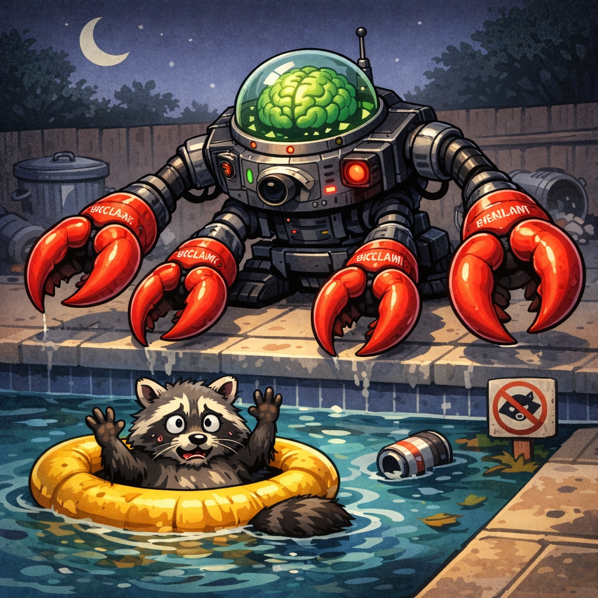
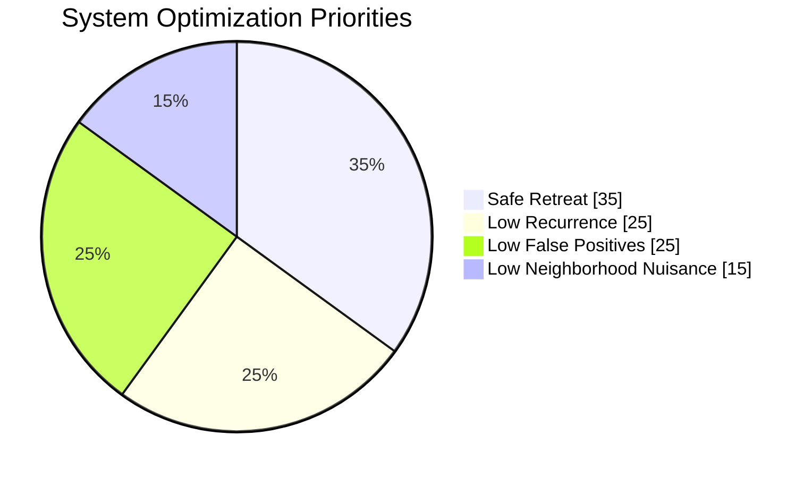
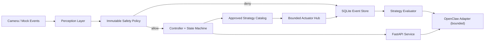
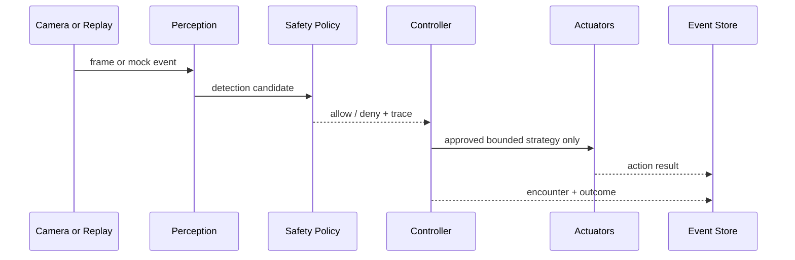

[](https://www.python.org/)
[](https://fastapi.tiangolo.com/)
[](#simulation)
[](LICENSE)
[](#project-status)
[](#safety-first)

# trash-panda Robocop



`trash-panda Robocop` is the public-facing identity for the `raccoon_guardian` codebase: a production-minded, safety-first starter kit for a humane perimeter deterrence system aimed at nighttime wildlife entry events near a backyard gate or pool boundary. It is designed for Raspberry Pi class hardware, but the first-class development path is simulation, image capture, and mock hardware so the repo is useful before a camera, pump, light, or speaker is ever attached.

## Why This Exists

Backyard gate and pool-boundary monitoring systems often collapse into one of two bad extremes: toy demos that are not auditable, or over-aggressive concepts that should never be deployed. This project aims for the middle ground:

- serious software architecture
- explicit humane constraints
- simulation-first local development
- bounded actuator control
- honest documentation about what is real versus stubbed

## The Story

What if we gave OpenClaw a very small, very opinionated nighttime robotics shell?

Not unrestricted hardware control. Not a freeform agent with permission to improvise. Instead:

- a Raspberry Pi watching a backyard gate
- a camera pipeline that can capture and review what it saw
- a strict safety layer that refuses to act on people and pets
- a tiny approved playbook of humane deterrence strategies
- an evaluation loop that learns which safe strategy works best over time

That is the spirit of `trash-panda Robocop`: a slightly cinematic name wrapped around a deliberately cautious architecture.

## Project Status

This repository is currently `alpha`.

- The software architecture, API, tests, simulation runner, and safety policy are real and runnable
- The perception layer now includes frame capture, snapshot persistence, and model-ready detector adapters
- The default actuator path is still mock-first by design
- The repo is intended as an open-source starter kit, not a finished consumer product

## Safety First

The repository assumes a safety-first operating model:

- No harmful deterrence methods
- No trapping, cornering, chasing, or physical contact
- No chemicals, heat, lasers, or flame
- A hard-coded safety layer that the strategy selector cannot bypass
- Measured adaptation only within a pre-approved catalog of bounded strategies

## Design Priorities



## What Makes Up trash-panda Robocop

- `the watcher`: camera capture, frame packets, snapshots, and detector backends
- `the referee`: immutable safety policy, geofence checks, arm windows, and cooldowns
- `the playbook`: a fixed catalog of approved deterrence strategies
- `the body`: bounded light, sound, water, and optional pan actuator interfaces
- `the memory`: SQLite encounter logging and nightly summaries
- `the strategist`: OpenClaw integration through bounded tools only
- `the lab`: simulation replay, mock hardware, tests, and local development scripts

## What It Includes

- A deterministic state machine for `DISARMED -> IDLE -> DETECTING -> DECIDING -> ACTING -> COOLDOWN`
- A pluggable perception layer with frame capture, annotated snapshot persistence, mock detections, and model-ready detector adapters
- A non-bypassable safety policy with human and pet exclusion, geofencing, scheduling, cooldown, and action duration caps
- Mock actuator interfaces for light, sound, water spray, and optional pan motion
- A fixed catalog of approved strategies with simple effectiveness scoring
- A SQLite encounter log and nightly summary endpoint
- A bounded OpenClaw integration surface that can only read outcomes and choose from approved strategies
- FastAPI endpoints for local control and simulation

## At a Glance

| Area | Included Now | Still Future Work |
| --- | --- | --- |
| API | FastAPI health, config, events, strategies, summaries | auth and remote deployment hardening |
| Perception | frame packets, snapshots, mock detector, frame-difference detector, model adapter | production wildlife model and privacy-aware redaction |
| Safety | human/pet exclusion, geofence, arm window, cooldown, actuation caps | field validation on physical deployments |
| Actuation | bounded interfaces and mock hub | real GPIO relay, audio, water, and servo drivers |
| Evaluation | SQLite encounter store and nightly ranking | richer longitudinal adaptation and dashboards |

## Architecture Summary



More detail lives in [docs/architecture.md](/Users/laurent/Development/trash-panda-robocop/docs/architecture.md) and [docs/hardware.md](/Users/laurent/Development/trash-panda-robocop/docs/hardware.md).

## How a Night Works



## Quickstart

### 1. Install dependencies

```bash
make install
```

If you use `uv`, the Makefile will prefer it automatically.

### 2. Run the API locally

```bash
make run
```

The default API will listen on `127.0.0.1:8000`.

### 3. Run the night simulation

```bash
make simulate
```

This replays a sample night including:

- a raccoon entering the gate zone
- a cat passing by
- a person entering the yard
- a repeated raccoon return later in the night

### 4. Run quality checks

```bash
make lint
make typecheck
make test
```

### 5. Review the docs

- [docs/architecture.md](/Users/laurent/Development/trash-panda-robocop/docs/architecture.md)
- [docs/hardware.md](/Users/laurent/Development/trash-panda-robocop/docs/hardware.md)
- [docs/safety-policy.md](/Users/laurent/Development/trash-panda-robocop/docs/safety-policy.md)
- [docs/strategy-evaluation.md](/Users/laurent/Development/trash-panda-robocop/docs/strategy-evaluation.md)
- [ROADMAP.md](/Users/laurent/Development/trash-panda-robocop/ROADMAP.md)

## Simulation

The default experience is intentionally mock-driven:

- `MockDetector` yields structured detections
- `MockActuatorHub` records actions without touching hardware
- `NightSimulator` replays a full event sequence end-to-end
- API endpoints let you inject synthetic detections with `POST /events/mock`

This keeps local iteration fast while making room for later real camera and GPIO work.

## Perception Upgrade

The repo now includes a stronger bridge between simulation and future real-world inference:

- `FramePacket` objects for typed frame transport
- `FrameSnapshotWriter` for saving frames plus JSON metadata
- `FrameDifferenceDetector` for deterministic motion-based local testing
- `ExternalModelDetector` for future ONNX, TFLite, or remote model backends
- a perception pipeline that converts detector candidates into zone-aware `DetectionEvent` objects

The relevant modules live under [src/raccoon_guardian/perception/](/Users/laurent/Development/trash-panda-robocop/src/raccoon_guardian/perception).

## Public-Facing API

The local FastAPI service includes:

- `GET /health`
- `GET /config`
- `POST /arm`
- `POST /disarm`
- `POST /events/mock`
- `GET /events`
- `GET /strategies`
- `POST /strategies/select`
- `GET /summary/nightly`
- `POST /actuate/test` when explicitly enabled in config

## Hardware Philosophy

The target deployment is a weatherproof Raspberry Pi-based outdoor node:

- Raspberry Pi 4B or 5
- CSI or USB low-light camera
- isolated low-voltage control for water valve or pump relay
- visible strobe-capable LED module
- short-duration speaker cue path
- optional pan actuator with bounded presets only
- physical kill switch and weatherproof enclosure

Hardware planning, GPIO abstraction, power budgeting, and a suggested BOM are documented in [docs/hardware.md](/Users/laurent/Development/trash-panda-robocop/docs/hardware.md).

## Safety Controls

The hard-coded policy denies or bounds actions when any of the following are true:

- the target is a human
- the target is a pet
- the system is outside configured arm hours
- the event is outside deterrence-enabled geofenced zones
- manual disable is active
- the cooldown window has not elapsed
- requested sound or water duration exceeds configured limits

Every decision carries an explicit trace so operators can inspect why a strategy was allowed, clamped, or denied.

## OpenClaw Integration

OpenClaw is treated as an external strategy selector, not a freeform hardware controller. It may only:

- read recent outcomes
- list approved strategies
- set the next approved strategy
- request nightly summaries

It may not issue arbitrary actuator commands. See [docs/opencclaw-integration.md](/Users/laurent/Development/trash-panda-robocop/docs/opencclaw-integration.md).

## Documentation Map

- [README.md](/Users/laurent/Development/trash-panda-robocop/README.md): project overview and quickstart
- [docs/architecture.md](/Users/laurent/Development/trash-panda-robocop/docs/architecture.md): system and deployment diagrams
- [docs/hardware.md](/Users/laurent/Development/trash-panda-robocop/docs/hardware.md): Raspberry Pi hardware plan and BOM
- [docs/safety-policy.md](/Users/laurent/Development/trash-panda-robocop/docs/safety-policy.md): immutable safety constraints
- [docs/opencclaw-integration.md](/Users/laurent/Development/trash-panda-robocop/docs/opencclaw-integration.md): bounded external strategy control
- [docs/strategy-evaluation.md](/Users/laurent/Development/trash-panda-robocop/docs/strategy-evaluation.md): scoring and adaptation loop
- [CONTRIBUTING.md](/Users/laurent/Development/trash-panda-robocop/CONTRIBUTING.md): contribution guidelines
- [SECURITY.md](/Users/laurent/Development/trash-panda-robocop/SECURITY.md): security and safety reporting
- [ROADMAP.md](/Users/laurent/Development/trash-panda-robocop/ROADMAP.md): planned evolution

## Repository Layout

```text
.
├── configs/
├── docs/
├── scripts/
├── src/raccoon_guardian/
├── tests/
└── .github/
```

## What Is Mocked vs Real

Implemented now:

- mock detector
- mock actuator hub
- FastAPI control surface
- safety engine
- SQLite encounter store
- simulation replay and tests

Still stubbed for future hardware work:

- GPIO relay control
- actual solenoid / pump driver integration
- real audio playback backend
- servo / pan hardware control
- production ML wildlife detector
- camera calibration for deployment-specific geofences

## Contributing

Contributions are welcome, especially around perception, simulation, safe hardware abstraction, evaluation, and docs. Please start with:

- [CONTRIBUTING.md](/Users/laurent/Development/trash-panda-robocop/CONTRIBUTING.md)
- [CODE_OF_CONDUCT.md](/Users/laurent/Development/trash-panda-robocop/CODE_OF_CONDUCT.md)
- [SECURITY.md](/Users/laurent/Development/trash-panda-robocop/SECURITY.md)

## Next Steps

- Replace the mock detector with a real low-light wildlife detection pipeline
- Add image snapshot retention with privacy-aware redaction policies
- Introduce hardware-in-the-loop tests on Raspberry Pi
- Build richer nightly adaptation logic on top of the bounded strategy interface
