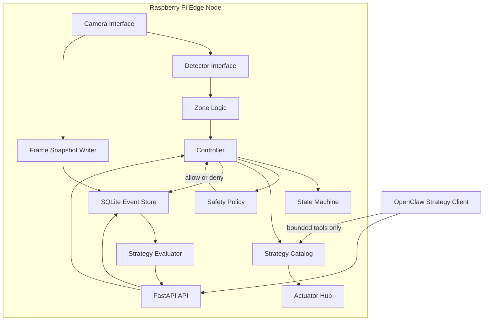
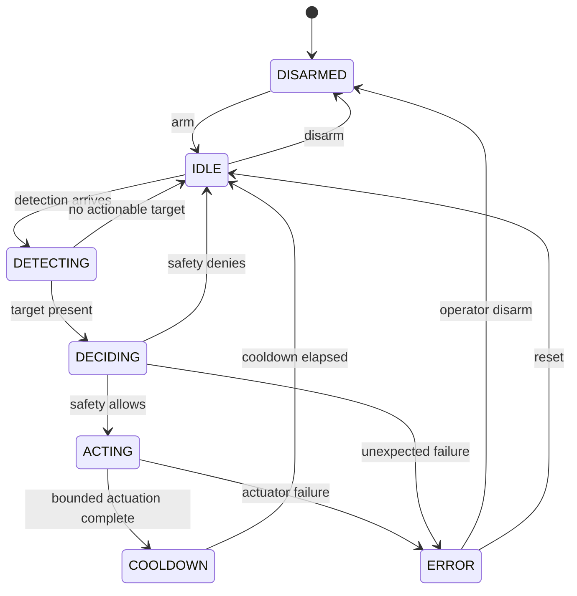
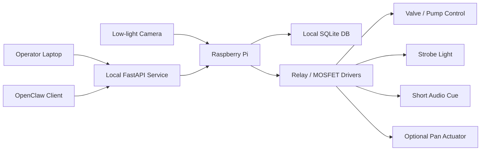

# Architecture

`raccoon-guardian` is organized around a narrow control loop:

1. Perception produces structured detections
2. Safety decides whether any deterrence is permitted
3. The controller selects one approved strategy
4. Mock or real actuator drivers execute bounded commands
5. Outcomes are logged and scored for later adaptation

## Technical Diagram

## Component Diagram

## State Model

## Runtime Boundaries

- `perception/` converts raw frames or replay input into structured detections
- `perception/capture.py` persists raw or annotated snapshots for debugging and future dataset building
- `safety/` is the immutable policy boundary
- `strategies/` holds a fixed catalog only
- `actuators/` is where GPIO-capable drivers can be added later
- `tools/` exposes a bounded function layer for OpenClaw
- `simulation/` makes the system testable before hardware arrives

## Why the Strategy Layer Is Constrained

This project deliberately avoids autonomous action generation. The strategy layer can select only from approved named strategies whose action sequences are already reviewed and bounded. That means:

- no arbitrary actuator timing
- no arbitrary pan sweeps
- no direct hardware tool invocation by an external agent
- no path around the safety engine

## Deployment Topology

