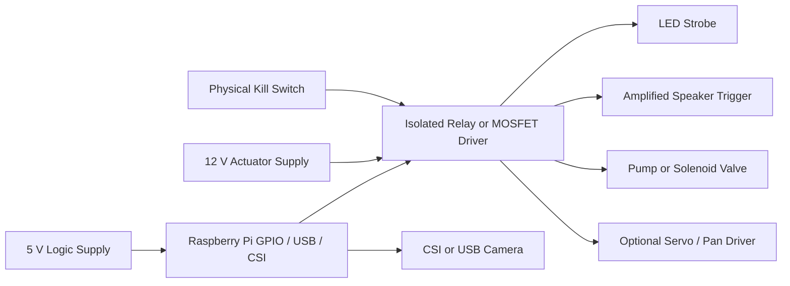

# Hardware Plan

This project targets an outdoor Raspberry Pi deployment but keeps hardware behind interfaces so simulation and mock testing stay first-class.

## Design Goals

- Outdoor-capable, weather-aware packaging
- Low-voltage isolation between the Pi and actuator power rails
- Bounded actuation with fail-safe defaults
- Easy swap between mock and real drivers
- A physical kill switch that overrides software state

## Suggested Bill of Materials

| Category | Suggested Part | Notes |
| --- | --- | --- |
| Compute | Raspberry Pi 4B or Raspberry Pi 5 | 4 GB RAM is sufficient for the first version |
| Storage | Industrial microSD or USB SSD | Prefer higher endurance media |
| Camera | Raspberry Pi Camera Module 3 or low-light USB camera | Use a stable mount with known field of view |
| Lighting | Outdoor-rated LED strobe or LED flood with controllable flash pattern | Visible deterrence only, no high-power beam devices |
| Sound | Small amplified weather-resistant speaker | Keep cues short and low nuisance |
| Water | 12 V DC pump or normally-closed solenoid valve | Driver must be electrically isolated |
| Driver board | Opto-isolated relay board or MOSFET driver board | One channel per actuator path |
| Pan motion | Slow servo or geared pan mount | Optional and bounded to small presets |
| Power | 5 V Pi supply plus separate fused 12 V rail for actuators | Shared ground only if driver design requires it |
| Safety | Latching kill switch and in-line fuse | Kill switch should cut actuator power, not just software arm state |
| Enclosure | IP65+ enclosure with cable glands | Include ventilation strategy and drip loops |

## Hardware Abstraction Layers

- `actuators/light.py` for a strobe-capable light output
- `actuators/sound.py` for brief audio cues
- `actuators/water.py` for a bounded valve or pump trigger
- `actuators/pan.py` for optional preset movement
- `perception/camera.py` for CSI or USB capture

The real driver files are intentionally conservative. They log intent and leave `TODO` hooks rather than pretending GPIO control already exists.

## Production-Oriented Accessory Set

For a more production-ready fixed-base node, the recommended accessory stack is:

- low-light camera for gate and pool-edge visibility
- visible strobe light
- weather-resistant speaker for short cues
- bounded water spray module
- small pan head or arm-head preset mount for stationary scan rounds
- physical kill switch
- isolated relay or MOSFET driver board

Optional and more experimental:

- diffuse low-force air puff module
- additional status LEDs for maintenance diagnostics
- arm-mounted cluster that keeps the camera, light, and nozzle aligned on a fixed base

## Reusing Existing Raspberry Pi Bot-Class Hardware

If you already have small Raspberry Pi robot parts on hand, many of them can be reused safely here:

- CSI or USB camera modules from Pi rover kits
- PCA9685 servo hats for bounded pan presets
- opto-isolated relay boards often bundled with Pi automation kits
- compact amplified speakers used for robot status cues
- existing 5 V logic power accessories and enclosure cable glands

What should *not* be reused blindly:

- mobile chassis drive systems
- pursuit-oriented motion behaviors
- unbounded pan or sweep code
- any hardware setup that points water, light, or sound beyond the intended property boundary

Even when a robot arm or pan assembly is present, the intended motion is limited to small preset repositioning and stationary guard rounds. It should not become a pursuit platform.

The design goal is to reuse commodity Pi ecosystem parts while removing any behavior that could chase, corner, or physically contact wildlife.

## Example Wiring Topology

## Power and Safety Notes

- Keep Pi logic power separate from actuator power
- Use flyback protection for inductive loads such as relays, pumps, and valves
- Default all actuators to off on boot and on process crash
- Route actuator cabling away from the camera and CSI ribbon path
- Treat the kill switch as a power path override, not just a GPIO input
- Use weatherproof connectors and strain relief at the enclosure edge

## Camera Placement Guidance

- Mount high enough to see the gate approach and protected boundary in a single frame
- Avoid pointing directly into bright neighboring windows or road traffic
- Calibrate the `gate_entry` and `backyard_protected` polygons from the installed viewpoint
- Re-check zones after seasonal landscaping changes

## Example GPIO Allocation Plan

| Function | Interface | Example |
| --- | --- | --- |
| Camera | CSI / USB | CSI-0 |
| Light trigger | GPIO output to isolated driver | GPIO 17 |
| Sound trigger | GPIO output to isolated driver | GPIO 27 |
| Water trigger | GPIO output to isolated driver | GPIO 22 |
| Kill switch input | GPIO input with pull-up | GPIO 23 |
| Pan PWM | Servo HAT or dedicated controller | I2C / PCA9685 |

These are examples only. Final pinout should follow the chosen relay board, servo controller, and enclosure routing.

## Environmental Hardening

- Use drip loops on all external cables
- Keep the speaker and light angles within property boundaries
- Position the water outlet toward the gate or threshold area rather than directly at animals
- Add service slack and label every cable inside the enclosure
- Schedule regular nozzle inspection to avoid pressure spikes or drift
