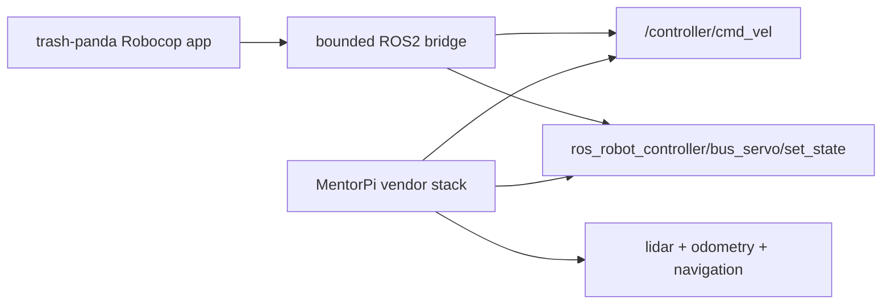

# MentorPi Software Reuse

This note maps the official `MentorPi` software stack to `trash-panda Robocop` so we can reuse the useful rover and driver layers without inheriting the full demo-app stack.

## What The Official Stack Gives Us

From the official Hiwonder docs:

- the robot ships with a Docker-based software environment
- the function code and source live inside the container
- the container layout includes:
  - `app`
  - `example`
  - `bringup`
  - `driver`
  - `interfaces`
  - `peripherals`
  - `navigation`
  - `slam`
  - `yolov5_ros2`
  - `simulations`

Source:

- [Hiwonder remote tool installation and container access](https://docs.hiwonder.com/projects/MentorPi-T1/en/latest/docs/2.remote_tool_installation_and_container_access.html)

The official motion-control lessons also show the key control interfaces:

- motion topic: `/controller/cmd_vel`
- app-facing motion topic: `/cmd_vel`
- low-level motor topic: `ros_robot_controller/set_motor`
- servo topic: `ros_robot_controller/bus_servo/set_state`
- pose topic: `set_pose`
- startup service: `start_node.service`

Source:

- [Hiwonder MentorPi motion control lesson](https://wiki.hiwonder.com/projects/MentorPi/en/latest/docs/4.motion_control_lesson.html)

## Reuse Matrix

### Reuse Directly

- `driver`
  - best place to reuse low-level rover control and calibration behavior
- `peripherals`
  - likely contains vendor-specific hardware access for lidar, buzzer, or auxiliary devices
- `interfaces`
  - useful if we want to bridge cleanly into the vendor message/service layer
- `navigation`
  - useful later for waypoint patrol and fixed observation posts
- `slam`
  - useful if we want map-based guard rounds

### Reuse Carefully

- `bringup`
  - good for learning how the rover boots its ROS graph
  - should be simplified for field deployment
- `app`
  - can reveal how vendor remote control and app commands are routed
  - usually too demo-oriented to trust as the product control plane
- `yolov5_ros2`
  - potentially useful as a reference for camera-to-inference flow
  - should not be assumed production-ready for nighttime wildlife detection

### Mostly Ignore

- `example`
  - useful for learning, not for field deployment
- `simulations`
  - nice reference, but not on the critical path for MVP rover deployment

## Recommended Product Split

For `trash-panda Robocop`, we should split responsibilities like this:

### Keep Hiwonder For

- motor control
- steering control
- lidar bringup
- servo/pan control
- calibration files
- ROS2 motion stack

### Replace With Our Stack For

- perimeter safety logic
- deterrence strategy selection
- event logging
- nightly summaries
- mission agents
- OpenClaw integration
- operator API

## Practical Recommendation

Do not try to replace the rover vendor driver stack on day one.

Instead:

1. keep the vendor motion and hardware drivers
2. disable or bypass the vendor demo app layer
3. run `trash-panda Robocop` beside the ROS2 stack
4. bridge into rover movement through bounded ROS2 commands only

That gives us:

- faster hardware bringup
- lower risk around wheel, steering, and lidar control
- a cleaner path to a real field test

## What To Disable

The official docs note that the app service can be restarted with:

```bash
sudo systemctl restart start_node.service
```

For our use case, the vendor app service is useful for diagnostics, but we should avoid leaving it as the main operator surface once `trash-panda Robocop` is in charge.

Recommended stance:

- keep it available for fallback diagnostics
- do not expose it as the primary mission control path
- prefer our FastAPI + OpenClaw bounded control plane

## Suggested Integration Pattern



## First-Boot Audit

On a fresh MentorPi rover, inspect:

1. Docker container presence
2. active ROS2 topics
3. `start_node.service` status
4. controller package layout
5. calibration files under the vendor workspace

Use:

- [mentorpi_audit.sh](/Users/laurent/Development/trash-panda-robocop/scripts/mentorpi_audit.sh)

## Safe Reuse Goals

Near term:

- reuse wheel and steering drivers
- reuse lidar bringup
- reuse camera pan servo path
- reuse ROS2 motion topics for bounded patrols

Later:

- reuse waypoint or map support for patrol rounds
- reuse calibration and odometry tooling

Never rely on vendor demos for:

- humane safety policy
- actuation safety constraints
- agent autonomy boundaries
- operator audit trail

Those remain product-owned in `trash-panda Robocop`.
