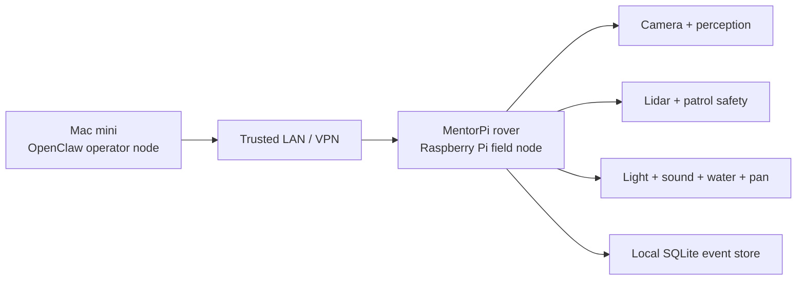

# MentorPi Starter Kit

This is the `trash-panda Robocop` hacker-style starter build: a small wheeled robot based on an existing Raspberry Pi rover kit, adapted into a humane perimeter sentinel instead of a chase bot.

## Core Idea

Use an off-the-shelf Raspberry Pi rover as the body so we do not need to fabricate:

- chassis
- steering
- wheels
- motor drivers
- battery system
- camera mast
- basic robotics stack

Then layer `trash-panda Robocop` on top as:

- a safe perimeter deterrence payload
- a bounded software stack
- a Mac mini OpenClaw operator brain

## Recommended Base

Primary candidate:

- `Hiwonder MentorPi A1 monocular version`

Why it fits:

- Raspberry Pi 5-based rover
- Ackermann wheeled platform
- 2DOF camera mount
- lidar
- encoder motors
- ROS 2 oriented developer ecosystem

This is a strong starter body for a `mobile sentinel` so long as we keep motion bounded and do not let the robot pursue animals during deterrence.

Official reference:

- [Hiwonder MentorPi A1 monocular](https://www.hiwonder.com/products/mentorpi-a1-monocular-camera-version?variant=41370001244247)

## Recommended System Shape



## Full Kit

### Keep From The MentorPi Base

- Raspberry Pi 5 compute stack
- drive chassis and steering
- battery and charge path
- lidar for patrol safety and localization
- encoder motors
- stock pan camera bracket if mechanically solid enough
- base frame and expansion mounting points

### Replace Or Upgrade

- upgrade the stock monocular camera if nighttime image quality is weak
- add a weather-aware shell or splash shielding
- add a dedicated visible deterrence light
- add a short-cue speaker path
- add a bounded water valve or micro-pump payload
- add an external physical kill switch reachable without software

### Recommended Add-Ons

- `Camera`
  - preferred: `Raspberry Pi Camera Module 3 Wide NoIR`
  - reason: official Raspberry Pi docs list 120 degree FoV on the wide model and NoIR support for night-vision use with IR illumination
- `Audio`
  - small amplified speaker path such as an I2S Pi speaker bonnet or equivalent compact amp
- `Light`
  - visible LED deterrence module aimed at threshold zones, not neighboring property
- `Water`
  - low-duty-cycle valve or pump trigger for short threshold spray bursts
- `Pan`
  - keep to the existing 2DOF camera head or equivalent small preset repositioning only
- `Enclosure`
  - splash cover, cable strain relief, and sealed electronics compartment
- `Safety`
  - inline fuse, hard kill switch, and isolated actuator power rail

Official references:

- [Raspberry Pi 5 product brief](https://www.raspberrypi.com/news/introducing-raspberry-pi-5/)
- [Raspberry Pi Camera Module 3](https://www.raspberrypi.com/products/camera-module-3/)
- [Raspberry Pi camera documentation](https://www.raspberrypi.com/documentation/hardware/camera/picam/)
- [Adafruit Speaker Bonnet guide](https://learn.adafruit.com/adafruit-speaker-bonnet-for-raspberry-pi/overview)

## The Hacker Build

If you want the fast, slightly scrappy, high-leverage version:

### Tier 1: Fast Prototype

- use the MentorPi body mostly stock
- mount the deterrence light and small speaker first
- keep water mocked in software until the chassis proves stable
- run the current FastAPI service directly on the rover Pi
- run OpenClaw on the Mac mini

### Tier 2: Backyard Field Rig

- replace the camera if the stock one underperforms at night
- add weather shielding and a proper actuator power rail
- add short-burst water payload
- define fixed patrol waypoints and stop zones
- enable morning summaries and Slack escalation

### Tier 3: Production-Like Sentinel

- add service supervision and watchdog recovery
- calibrate patrol points and geofences against the real yard
- validate nuisance, false-positive, and retreat metrics over repeated nights
- keep motion rules locked to non-pursuit behavior

## Mobility Rules

This is the part that matters most.

`trash-panda Robocop` may be mobile, but it must not become a pursuit robot.

Allowed motion:

- slow patrol rounds before or between events
- repositioning to fixed observation posts
- short local moves to regain line of sight
- safe-park retreat on hazard-class wildlife

Disallowed motion:

- closing distance during active deterrence
- following an animal
- cornering behavior
- high-speed interception
- any motion pattern that could trap or herd wildlife

In short:

- `patrol`
- `observe`
- `stop`
- `deter from a fixed stance`
- `retreat or safe-park`

Not:

- `chase`

## Sound Pack Direction

For product personality, the repo should support a `retro trash-talking robot announcer` sound pack.

Recommended public approach:

- ship original lines only
- keep clips short
- allow quiet-mode filtering
- avoid repetitive neighborhood nuisance

Private local deployments can load user-supplied clips from a local folder, but the public repository should not bundle copyrighted TV or film audio without rights.

Tone target:

- sardonic
- funny
- mechanical
- not cruel
- not aggressive

## Software Mapping

How this rover maps into the current repo:

- `perception/`
  - camera ingest and detector interface
- `safety/`
  - human, pet, zone, cooldown, and hazard rules
- `actuators/`
  - light, sound, water, and pan
- `control/`
  - state machine, scheduler, guard rounds
- `tools/`
  - bounded OpenClaw adapter
- `integrations/opencclaw/`
  - Mac mini plugin and agent pack

## Recommended Build Decision

If you want the fastest credible path:

- buy the `MentorPi A1`
- keep the chassis stock
- upgrade the night camera if needed
- treat it as a `mobile sentinel`
- run OpenClaw on the Mac mini
- keep all direct hardware execution on the rover Pi

## Image Prompt

Use this to generate concept art, product hero shots, or pitch visuals:

```text
Design a product render for "trash-panda Robocop", a small Raspberry Pi backyard security rover built on a compact wheeled hacker robot base. The robot uses an Ackermann-style rover chassis inspired by DIY Pi robotics kits, with rugged black anodized metal framing, chunky all-terrain wheels, a front lidar puck, a 2DOF camera head, a visible deterrence light bar, a small speaker grille, and a compact water-spray module mounted low on the front. It should feel like a believable open-source field robot, not a toy, and not military. The personality is retro-futurist, mischievous, and slightly cyberpunk, with tasteful warning decals and humane-neighborhood-tech vibes. Show it parked near a backyard pool gate at night under moonlight, with subtle red and amber indicator LEDs, weatherproof cabling, and a Mac-mini-connected operator vibe. The style should be premium cinematic industrial design concept art, ultra-detailed, realistic materials, dramatic rim lighting, shallow fog, sharp focus, and a polished product-launch aesthetic.
```

## One-Line Art Direction

`a humane backyard rover that looks like a hacker-built night sentinel, not a weapon`
