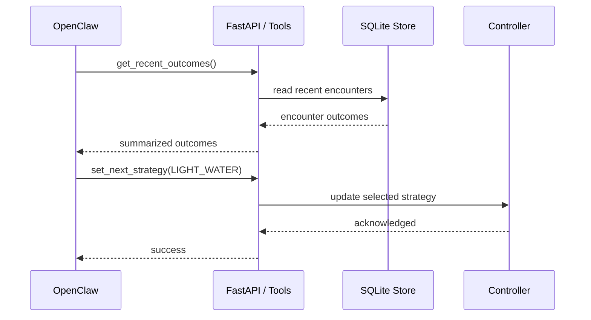

# OpenClaw Integration

This repository reserves the strategy layer for approved, bounded choices only. OpenClaw can participate as a reader and selector, but not as an unrestricted hardware controller.

## Allowed Operations

An OpenClaw-connected client may:

- read recent encounter outcomes
- list approved strategies
- set the current strategy for the next event window
- request nightly summaries

It may not:

- send arbitrary actuator commands
- change safety caps
- change arm windows
- bypass cooldown
- issue unrestricted pan or sweep motions

## Bounded Tool Model

The adapter in `src/raccoon_guardian/tools/opencclaw_adapter.py` wraps only these functions:

- `get_recent_outcomes(limit)`
- `list_strategies()`
- `set_next_strategy(strategy_name)`
- `get_nightly_summary(local_date)`

Each function operates entirely above the safety boundary.

## Integration Sequence

## Guardrails

- The selected strategy must exist in the fixed catalog
- The strategy affects only future events
- Safety policy is evaluated again at event time
- Encounter outcomes stay locally logged for auditability

## Recommended Operating Pattern

1. Start with `LIGHT_ONLY` or `LIGHT_SOUND`
2. Review nightly summaries for false positives and nuisance score
3. Escalate only within the approved catalog if recurrence remains high
4. De-escalate when simpler strategies are effective

