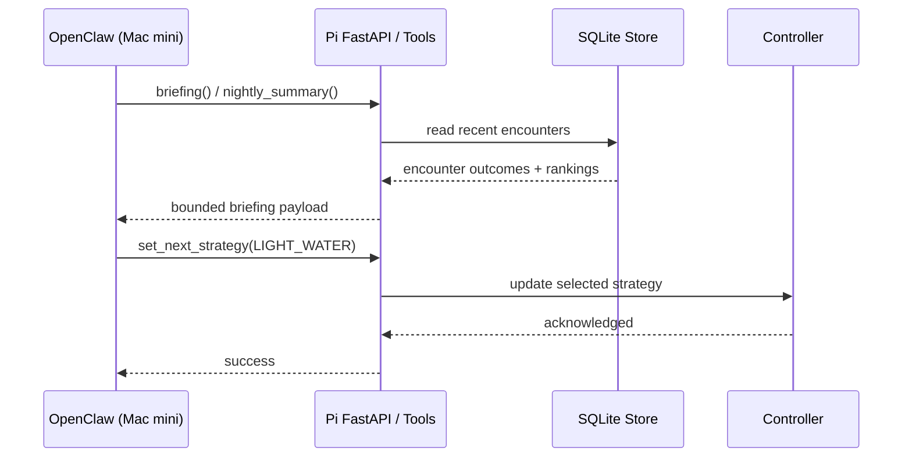

# OpenClaw Integration

This repository reserves the strategy layer for approved, bounded choices only. OpenClaw can participate as a reader and selector, but not as an unrestricted hardware controller.

## Recommended Deployment Shape

The cleanest field architecture is:

- `Raspberry Pi` at the gate or pool boundary
- `Mac mini` on the same trusted LAN running OpenClaw
- `FastAPI` on the Pi exposing only the bounded trash-panda Robocop control surface
- `X-API-Key` shared from the Pi service to the Mac mini plugin

That keeps the camera, actuator timing, and safety enforcement local to the Pi while leaving strategy review, chat interaction, and operator workflow on the Mac mini.

## Allowed Operations

An OpenClaw-connected client may:

- read recent encounter outcomes
- list approved strategies
- set the current strategy for the next event window
- request nightly summaries

It may not:

- send arbitrary actuator commands
- change safety caps
- change arm windows
- bypass cooldown
- issue unrestricted pan or sweep motions

## Bounded Tool Model

The adapter in `src/raccoon_guardian/tools/opencclaw_adapter.py` wraps only these functions:

- `get_recent_outcomes(limit)`
- `list_strategies()`
- `set_next_strategy(strategy_name)`
- `get_nightly_summary(local_date)`
- `get_briefing(limit, local_date)`

Each function operates entirely above the safety boundary.

The FastAPI service now also exposes bounded agent-facing endpoints:

- `GET /agent/opencclaw/manifest`
- `GET /agent/opencclaw/briefing`

## Integration Sequence



## Guardrails

- The selected strategy must exist in the fixed catalog
- The strategy affects only future events
- Safety policy is evaluated again at event time
- Encounter outcomes stay locally logged for auditability

## Mac Mini Setup

1. On the Raspberry Pi, run `trash-panda Robocop` with `RG_API_KEY` enabled.
2. On the Mac mini, install and configure OpenClaw.
3. Install the local plugin from `integrations/opencclaw/mac-mini-plugin/`.
4. Point the plugin at the Pi service URL and API key.
5. Restrict OpenClaw to the trash-panda tools only.

The sample plugin and config starter live here:

- `integrations/opencclaw/mac-mini-plugin/`
- `integrations/opencclaw/openclaw.sample.json`
- `integrations/opencclaw/mac-mini-agent/`
- `integrations/opencclaw/openclaw.mac-mini-agent.sample.json`

### Suggested Pi-side settings

- use `configs/backyard-gate-example.yaml`
- set `RG_API_KEY` in the Pi environment
- bind the API only to a trusted LAN or VPN
- leave direct actuation endpoints protected

### Suggested Mac mini plugin settings

```json
{
  "plugins": {
    "enabled": true,
    "entries": {
      "trash-panda-robocop": {
        "enabled": true,
        "config": {
          "baseUrl": "http://trash-panda-pi.local:8000",
          "apiKey": "replace-with-rg-api-key",
          "requestTimeoutMs": 5000
        }
      }
    }
  },
  "tools": {
    "allow": [
      "trash_panda_briefing",
      "trash_panda_list_strategies",
      "trash_panda_get_summary",
      "trash_panda_set_strategy"
    ]
  }
}
```

## Operator Prompt Pack

The repo also includes a Mac mini agent workspace pack that gives OpenClaw a disciplined operating posture instead of a generic assistant persona.

Included files:

- `AGENTS.md`: required workflow and decision rules
- `SOUL.md`: operator-side identity and tone
- `TOOLS.md`: bounded tool usage guidance
- `HEARTBEAT.md`: optional recurring review routine

Install it on the Mac mini with:

```bash
cd integrations/opencclaw/mac-mini-agent
./install.sh
```

That installs the workspace pack into `~/.openclaw/workspace-trash-panda-robocop` by default.

Then point OpenClaw at that workspace:

```json
{
  "agents": {
    "defaults": {
      "workspace": "~/.openclaw/workspace-trash-panda-robocop"
    }
  }
}
```

## Recommended Agent Behavior

- start with `trash_panda_briefing`
- summarize evidence before making recommendations
- prefer de-escalation when simpler strategies are working
- only call `trash_panda_set_strategy` after giving a reasoned recommendation
- refuse any request for direct actuator control
- escalate to a human when hazard wildlife or repeated failures are involved

## Recommended Operating Pattern

1. Start with `LIGHT_ONLY` or `LIGHT_SOUND`
2. Review nightly summaries for false positives and nuisance score
3. Escalate only within the approved catalog if recurrence remains high
4. De-escalate when simpler strategies are effective
