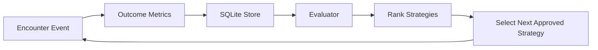

# Strategy Evaluation

The first version uses a lightweight scoring model to compare approved strategies without opening the door to arbitrary action generation.

## Outcome Fields

Each encounter may record:

- `retreat_detected`
- `seconds_to_exit_zone`
- `returned_within_10_min`
- `returned_same_night`
- `false_positive`
- `nuisance_score`

## Scoring Heuristic

The default evaluator rewards:

- fast retreat
- no short-term recurrence
- no same-night recurrence

It penalizes:

- false positives
- higher nuisance score

The result is a simple scalar score used for ranking strategies over recent encounters.

## Why It Is Intentionally Simple

- easy to inspect
- deterministic
- no hidden optimization behavior
- appropriate for a small local SQLite-backed starter system

## Adaptation Loop

## Operator Guidance

- Review sample size before trusting rankings
- Treat high false-positive counts as a strong signal to adjust perception or geofencing first
- Prefer the least nuisance-causing strategy that still produces consistent retreat
- Keep manual oversight in the loop for deployments near neighbors

